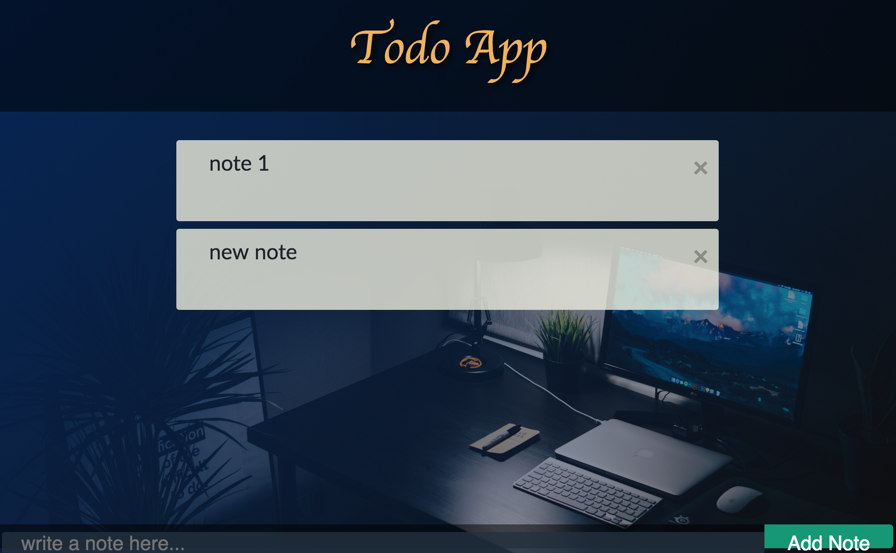

# React Firebase Todo App

based on this tutorial: https://www.youtube.com/watch?v=-RtJroTMDf4&t=2427s 

### Things you need to change or install 

install :
<ul>
  <li>npm install --save firebase</li>
</ul> 

change: 
change the `var config` in `./src/config/config.js` to your own keys

### What it looks like

